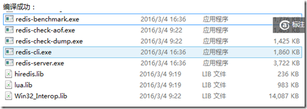

下面介绍windows如何编译hiredis，以及如何使用hiredis

### 环境

编译环境，64位windows8.1 ultimate，VS2013社区版 update5.

注意：这里vs一定要2013 update 5，否则无法正常编译，报错“make sure you have updated to Update 5, otherwise you will get a "illegal use of this type as an expression" error.”

### 获取redis windows

GitHub上的**MSOpenTech/redis**项目地址，[download zip](https://github.com/MSOpenTech/redis)

### 编译Redis

解压，进入msvs文件夹，解决方法RedisServer.sln

如果只需要，`hiredis.lib`和`win32_interop.lib`，则只需要从解决方案资源管理器窗口编译hiredis工程和Win32_Interop工程，此时便会在x64/debug目录下生成这两个工程编译的lib

注意：需要在上一步中，配置一下为`x64`结构，然后编译，在x64目录下可以看到如下结构：


### 使用Hiredis

具体`hiredis api`参考：https://github.com/redis/hiredis

**步骤：**

1 新建工程  
2 在工程属性中添加附加包含目录，`redis/src`和`deps/hiredis`  
3 添加附加库目录，指之前生成lib的目录，一般指"`redis/msvs/x64`  
4 添加附加依赖项：`hiredis.lib` 和 `win32_interop.lib`，可能也需要`ws2_32.lib`.  
5 复制`src/Win32_Interop/win32fixes.c`到自己的工程目录  
6 然后添加如下的实例代码，需要`include<hiredis.h>`和`<win32_interop\win32fixes.h>`，然后编译运行即可。


```
#include <ctime>
#include <hiredis.h>
#include <Win32_Interop/win32fixes.h>
int main()
{
    redisContext *c;
    redisReply *reply;

    //测试连接
    c = redisConnect((char*)"127.0.0.1", 6379)
    if (c != NULL && c->err) {
        printf("Error: %s\n", c->errstr);
        // handle error
    } else {
        printf("Connected to Redis\n");
    }
    //set hello world
    reply = (redisReply *)redisCommand(c, "SET %s %s", "hello", "world");
    printf("SET: %s\n", reply->str);
    freeReplyObject(reply);
    //get hello
    reply = redisCommand(c,"GET %s","hello");
    printf("%s\n",reply->str);
    freeReplyObject(reply);
    
    return 0;
}
```

### 可能出现的错误

1 “预编译头文件来自编译器的早期版本，或者预编译头为 C++ 而在 C 中使用它”，解决方法：在 solution explorer 中对相应文件点右键选择 properties，在 precompiled headers 项下设置 not using... 即可。

2 “各种重复定义”，解决方法：请右击项目->属性->配置属性->C/C++->代码生成->运行库->改成多线程调试(/MTd)或多线程(/MT)